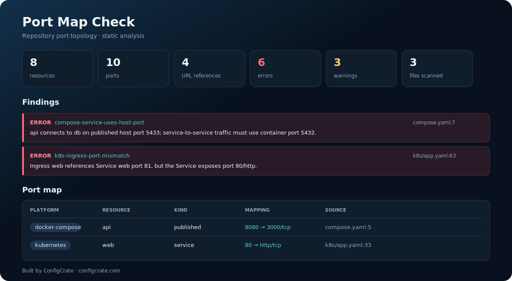

# Port Map Check

[](https://github.com/configcrate/port-map-check/actions/workflows/ci.yml)
[](https://github.com/configcrate/port-map-check/releases)
[](LICENSE)

Find broken port and service wiring before you start the stack.

Port Map Check scans repository configuration, builds one port map, and explains conflicts across Docker Compose, Kubernetes, Dockerfiles, devcontainers, healthchecks, probes, Ingress backends, and service URLs. It is static and local: no containers are started, no cluster is contacted, and no network requests are made.



## Why

The same port often has three different meanings:

- the port published on a developer's host;
- the port where an application listens inside a container;
- the port exposed by a Kubernetes Service.

Mixing them produces failures that ordinary YAML validation cannot see: `db:5433` when the database listens on `5432`, a healthcheck that calls the host-side mapping from inside the container, two services claiming the same host port, or an Ingress pointing at a Service port that does not exist.

Port Map Check correlates those declarations instead of linting each file in isolation.

## Quick start

```bash
go install github.com/configcrate/port-map-check/cmd/port-map-check@latest
port-map-check scan .
```

Generate a self-contained HTML report:

```bash
port-map-check scan . --format html --output port-map-report.html --fail-on never
```

Prebuilt binaries for Linux, macOS, and Windows are available from [Releases](https://github.com/configcrate/port-map-check/releases).

## GitHub Action

```yaml
name: Port wiring audit

on:
  pull_request:
  push:
    branches: [main]

jobs:
  port-map-check:
    runs-on: ubuntu-latest
    steps:
      - uses: actions/checkout@v7
      - uses: configcrate/port-map-check@v0.1.0
        with:
          fail-on: warning
```

To retain a report:

```yaml
      - uses: configcrate/port-map-check@v0.1.0
        with:
          format: html
          output: port-map-report.html
          fail-on: never
      - uses: actions/upload-artifact@v6
        with:
          name: port-map-report
          path: port-map-report.html
```

### Action inputs

| Input | Default | Description |
| --- | --- | --- |
| `path` | `.` | Repository directory to scan |
| `format` | `text` | `text`, `json`, or `html` |
| `output` | empty | Optional report output path |
| `fail-on` | `error` | `error`, `warning`, or `never` |
| `exclude` | empty | comma- or newline-separated repository-relative globs; `**` crosses directories |

## What it reads

| Source | Discovered data |
| --- | --- |
| `compose*.yml`, `compose*.yaml`, `docker-compose*.yml`, `docker-compose*.yaml` | services, short/long port mappings, `expose`, profiles, build context, environment URLs, healthchecks |
| Kubernetes YAML | workloads, container ports, probes, Services, selectors, target ports, NodePorts, Ingress backends, environment URLs |
| `Dockerfile`, `Dockerfile.*` | `EXPOSE` ports and protocols |
| `.devcontainer/devcontainer.json` and other `devcontainer.json` files | numeric and service-qualified `forwardPorts`; JSON comments and trailing commas are accepted |

Generated directories, dependencies, VCS metadata, and common build output are skipped.

## Rules

### Docker Compose

| Rule | Default severity | Detects |
| --- | --- | --- |
| `compose-duplicate-host-port` | error | two always-active services with overlapping host bindings; profile-gated conflicts are warnings |
| `compose-healthcheck-host-port` | error | a container healthcheck using the published side of a non-identical mapping |
| `compose-service-uses-host-port` | error | service-to-service URL using a host port instead of the target container port |
| `compose-localhost-cross-service` | warning | a container URL using localhost where another declared service matches the port |
| `compose-service-port-mismatch` | warning | a service URL whose port matches none of the destination's declared container ports |

### Kubernetes

| Rule | Default severity | Detects |
| --- | --- | --- |
| `k8s-duplicate-node-port` | error | duplicate explicit NodePort allocations, including across namespaces |
| `k8s-ingress-service-missing` | error | Ingress backend whose Service is absent from the scanned manifests |
| `k8s-ingress-port-mismatch` | error | Ingress backend using a missing Service port name or number |
| `k8s-target-name-mismatch` | error | Service `targetPort` name not declared by any selected workload |
| `k8s-target-port-mismatch` | warning | numeric `targetPort` differs from all declared selected-workload container ports |
| `k8s-probe-port-mismatch` | error/warning | invalid named probe ports, or suspicious undeclared numeric probe ports |
| `k8s-service-no-workload` | warning | Service selector matches no scanned workload |
| `k8s-service-port-reference-mismatch` | warning | an explicit in-cluster URL uses a port the Service does not expose |

### Cross-file

| Rule | Default severity | Detects |
| --- | --- | --- |
| `dockerfile-expose-mismatch` | warning | Compose target ports and the selected build-context Dockerfile's `EXPOSE` declarations do not overlap |

Every finding includes its source, rule code, explanation, and a suggested fix. See [`examples/broken-stack`](examples/broken-stack) for a compact repository that triggers the major rules, and [`examples/healthy-stack`](examples/healthy-stack) for the corrected version.

## CLI

```text
port-map-check scan [path] [flags]
port-map-check version
```

| Flag | Default | Description |
| --- | --- | --- |
| `--format` | `text` | `text`, `json`, or `html` |
| `--output` | empty | write the report to a file |
| `--fail-on` | `error` | exit 1 on `error`, `warning`, or `never` |
| `--max-file-size` | `2097152` | maximum candidate file size in bytes |
| `--exclude` | empty | repository-relative path glob to exclude; repeatable and supports `**` |

Options can appear before or after the scan path.

Exit codes:

- `0`: scan completed and the configured threshold was not reached;
- `1`: findings reached the configured threshold;
- `2`: invalid arguments, unreadable input, or report-generation failure.

## Report formats

- **Text** is concise and CI-friendly.
- **JSON** contains resources, normalized ports, URL references, findings, and summary counts.
- **HTML** is self-contained and includes a visual inventory suitable for build artifacts or review handoff.

Only URL hosts, ports, schemes, and contexts are retained. Usernames, passwords, query strings, and environment variable values are not written to reports.

## Accuracy and limitations

Port Map Check performs static repository analysis. It does not prove that a process listens on a port, inspect a running Docker daemon, connect to Kubernetes, or test reachability.

- Compose files are analyzed independently because development and production files often reuse the same host ports intentionally.
- Concrete numeric ports are required for correlation. Interpolated values and port ranges produce an unresolved-port warning.
- Numeric Kubernetes `containerPort` declarations are optional, so numeric Service/probe discrepancies are warnings. Missing named ports are errors because names must resolve.
- Helm templates containing `{{ ... }}` are skipped. Render them first with `helm template`, then scan the rendered directory.
- URL correlation currently requires an explicit supported scheme such as `http`, `postgres`, `redis`, `amqp`, or `mongodb`.
- Dockerfile `EXPOSE` is documentation rather than publication, so discrepancies are warnings.

These boundaries are deliberate: the tool prefers an explainable finding over pretending to understand runtime state it cannot observe.

## Development

```bash
go test ./...
go vet ./...
go run ./cmd/port-map-check scan examples/broken-stack --fail-on never
```

See [CONTRIBUTING.md](CONTRIBUTING.md) for rule and fixture expectations.

## Security

Port Map Check only reads local files and does not execute repository content. See [SECURITY.md](SECURITY.md) for reporting instructions and the static-analysis threat model.

## License

MIT

Built by [ConfigCrate](https://configcrate.com/).
